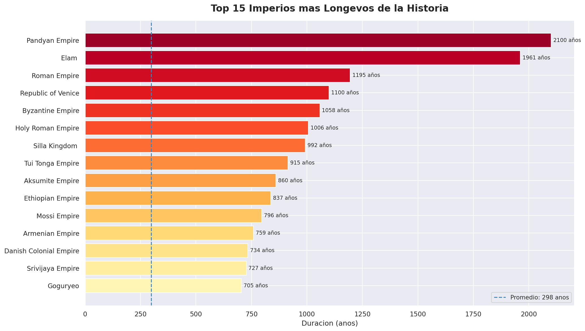
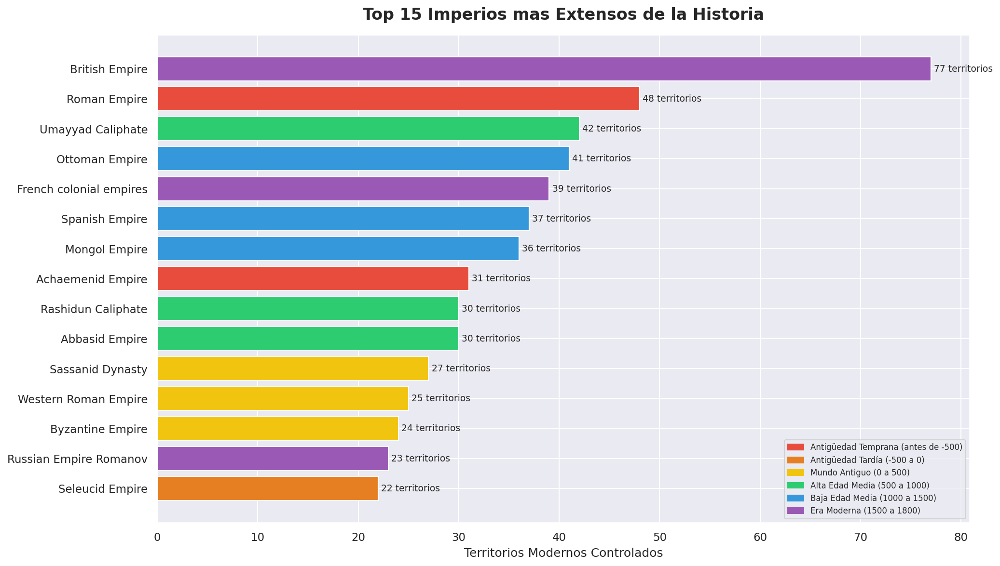
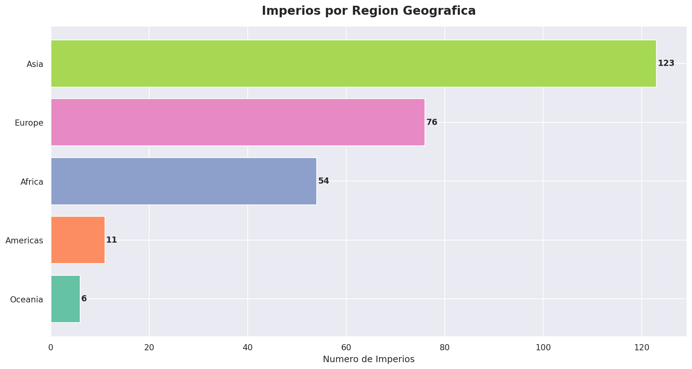
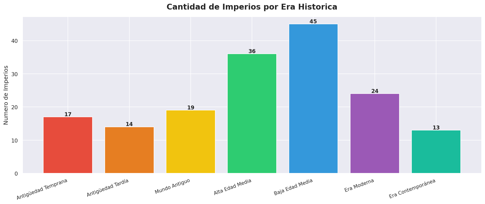
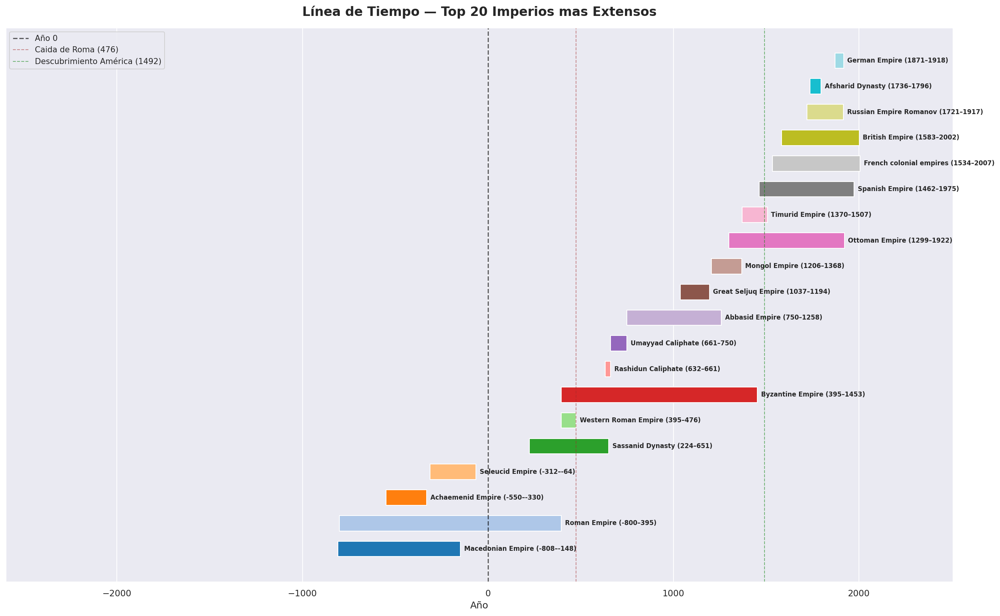
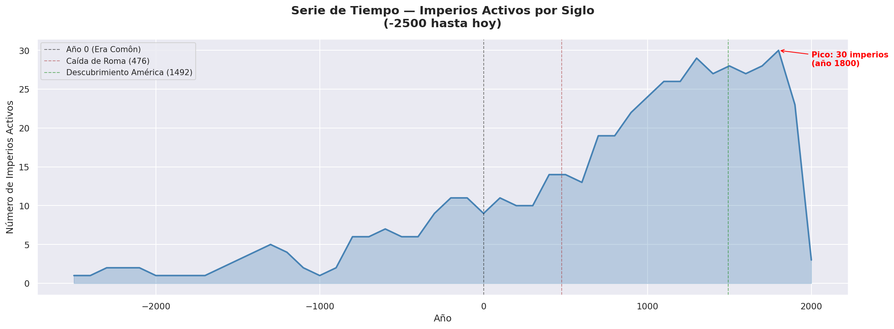
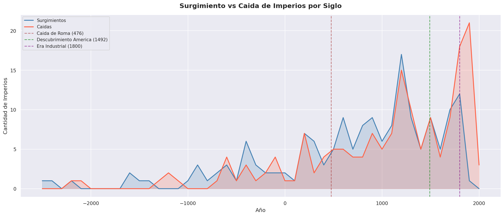
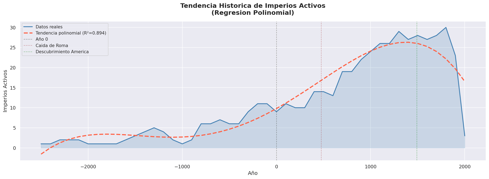
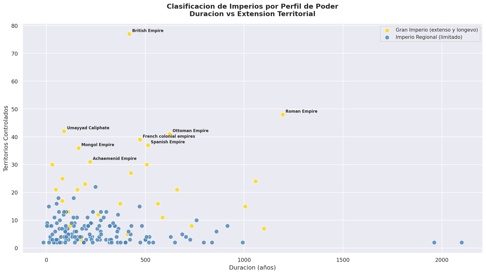

# Ascenso y Caida de los Grandes Imperios de la Historia


---

## Descripcion

Este proyecto analiza **168 imperios historicos** a lo largo de
**4500 anos de historia**, desde el Imperio Elam (-2500) hasta
los ultimos imperios coloniales del siglo XX. A traves de series
de tiempo, visualizaciones historicas y Machine Learning,
se identifican patrones en el surgimiento, expansion y colapso
de las grandes civilizaciones de la humanidad.

> *"Los imperios que priorizaron el comercio duraron mas
> que los que priorizaron la expansion territorial"*

---

## Objetivos

- Analizar la duracion y extension de los grandes imperios
- Identificar patrones temporales en surgimientos y caidas
- Modelar la tendencia historica con regresion polinomial
- Clasificar imperios por perfil de poder usando K-Means
- Comunicar 4500 anos de historia con visualizaciones

---

## Preguntas que responde este analisis

1. Cuales fueron los imperios mas longevos y extensos?
2. En que siglos surgieron y cayeron mas imperios?
3. Que factores determinaron la duracion de un imperio?
4. Que perfiles naturales existen entre los grandes imperios?
5. Puede un modelo capturar la tendencia historica imperial?

---

## Visualizaciones principales

| Grafico | Descripcion |
|---------|-------------|
|  | Top 15 imperios mas longevos |
|  | Top 15 imperios mas extensos |
|  | Imperios por region geografica |
|  | Imperios por era historica |
|  | Linea de tiempo de los 20 grandes imperios |
|  | Serie de tiempo 4500 anos |
|  | Surgimiento vs caida por siglo |
|  | Regresion polinomial historica |
|  | Clasificacion por perfil de poder |

---

## Machine Learning

### Series de Tiempo — Regresion Polinomial

| Metrica | Valor |
|---------|-------|
| Grado del polinomio | 4 |
| R² | 0.8944 |
| Variacion explicada | 89.4% |
| Rango temporal | -2500 a 2000 |

### Clustering — Perfiles de Poder

| Perfil | Duracion | Territorios | Comercio |
|--------|----------|-------------|---------|
| Imperio Regional | 272 años | 6 | 13% |
| Gran Imperio Territorial | 406 años | 27 | 4% |
| Imperio Comercial | 448 años | 8 | 67% |

### Hallazgo clave
Los imperios con mayor actividad comercial (Cluster 2)
fueron los mas longevos — superando incluso a los grandes
imperios territoriales en anos de duracion.

---

## Estructura del proyecto
```
imperios-historicos/
│
├── images/
│   └── (todas las visualizaciones)
│
├── Analisis_Imperios_Historicos.ipynb
├── README.md
└── requirements.txt
```

---

## Tecnologias utilizadas

- **Python 3.12**
- **Pandas** — manipulacion y series de tiempo
- **Matplotlib / Seaborn** — visualizacion historica
- **Scikit-learn** — Regresion Polinomial, K-Means, PCA
- **Google Colab** — entorno de desarrollo
- **GitHub** — control de versiones

---

## Como ejecutar el proyecto

1. Clona el repositorio:
```bash
git clone https://github.com/George1902/imperios-historicos.git
```

2. Instala las dependencias:
```bash
pip install -r requirements.txt
```

3. Descarga el dataset desde Kaggle:
   [World Empires Dataset](https://www.kaggle.com/datasets/stealthtechnologies/world-empires-dataset)
   y guardalo como `imperios.csv`

4. Abre el cuaderno en Google Colab o Jupyter

---

## requirements.txt
```
pandas
matplotlib
seaborn
scikit-learn
jupyter
```

---

## Fuente de datos

**World Empires Dataset**
Kaggle — Stealth Technologies
Dataset: https://www.kaggle.com/datasets/stealthtechnologies/world-empires-dataset

---

## Autor

**Jorge Ojeda**
Estudiante — Oracle Next Education (ONE) — Alura LATAM
Especializacion: Ciencia de Datos
2026

---

## Licencia

Proyecto de uso educativo y libre distribucion.
Los datos estan disponibles publicamente en Kaggle.
